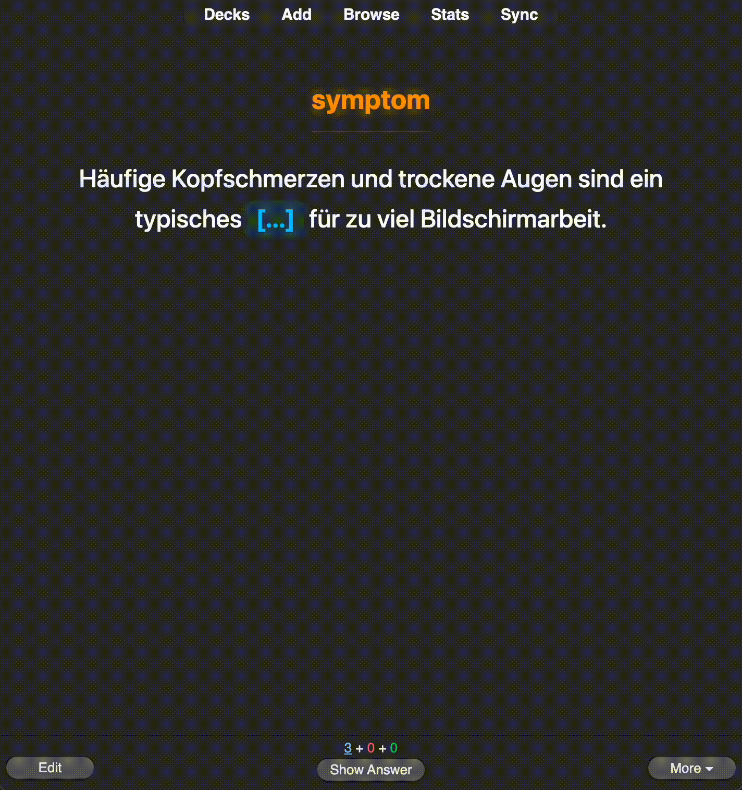

# 🧠 Anki-LLM-Pipeline: Autonomous Vocabulary Data Engine


<p align="center">
  
</p>

**The Problem:** Language learners waste hundreds of hours manually extracting vocabulary from PDFs, formatting translations, and structuring flashcards. 

**The Solution:** An autonomous Data Engineering pipeline that extracts raw text, normalizes it via LLMs, and asynchronously injects high-quality, TTS-enabled cloze cards directly into Anki's local database.

## 🎓 Academic Context
This project was developed by a 3rd-Semester Computer Science (Informatik) student at **HTW Dresden**. It serves as a practical application of Data Engineering, API integration, and Fault-Tolerant System Design concepts learned during the curriculum, specifically addressing rate-limiting constraints and automated I/O operations.

## ⚙️ Tech Stack
* **Language:** Python 3.10+
* **AI & NLP:** Google Gemini API (`gemini-3.6-flash`, `gemini-3.1-flash-lite`)
* **Data Extraction:** PyMuPDF (fitz)
* **Media & Database:** Edge-TTS, AnkiConnect (Local REST API)
* **Frontend (Anki UI):** HTML, CSS, Vanilla JavaScript (Regex DOM Manipulation)

## 📐 Architectural Decisions & Pragmatic Trade-offs

While initially conceptualized as a 100% autonomous script, a strategic **Hybrid Architecture (Human-in-the-Loop)** was adopted during development to balance model capabilities, API cost efficiency, and data safety.

| Pipeline | Target Language | Model | Automation Level | Rationale |
| :--- | :--- | :--- | :--- | :--- |
| **English** | English | `Gemini 3.6 Flash` | 100% Autonomous | Excellent syntax precision for English. Fast processing via API with zero manual input. |
| **German** | German | `Gemini Pro` | Hybrid | German grammar (gendered articles, case declensions) requires higher-tier LLM reasoning to avoid subtle errors in Cloze cards. |

> *Core Engineering Philosophy: **Data Quality & Accuracy > Blind Full-Automation.***

```mermaid
graph TD
  A[Raw PDF Data] -->|ETL Scripts| B(Normalized Master List)
  B --> C{Agent Part 1}
  C -->|"API Success (English)"| D[Daily Output CSV]
  C -->|"Rate Limit / Pro Demand (German)"| E[Manual Pro Fallback TXT]
  D --> F{Agent Part 2}
  E -->|"Manual Ingestion via Web LLM"| F
  F -->|"TTS Generation & REST API"| G[(Anki Local Database)]
  ```

### 🛡️ Engineering Highlights

* **Exponential Backoff:** The system dynamically doubles wait times upon encountering API rate limits (429 errors), preventing server overload.
* **Stateful Processing:** The pipeline strictly updates data queues only after successful processing. If power is lost or an API fails, the system resumes with 0% data loss.

## 🎨 Anki Card UI Engine

The project transcends standard automation by including an advanced, pre-configured frontend template for Anki (`/anki_template`).

* **Dynamic Colorization:** Utilizes JavaScript Regex within the Anki template to automatically color-code German articles upon rendering, enhancing cognitive retention.
* **Japanese Glue Algorithm:** A custom Python utility that merges fragmented HTML tags generated by the LLM to formulate seamless, error-free cloze deletions.
* **Asynchronous Audio:** Integrates Edge TTS directly into the pipeline payload, ensuring native pronunciation without manual recording.

## 🚀 Installation & Customization

### 1. Prerequisites

* Install [Anki](https://apps.ankiweb.net) and ensure it is running in the background.
* Install the [AnkiConnect](https://ankiweb.net/shared/info/2055492159) add-on (Code: `2055492159`) to enable the local REST API.

### 2. Environment Setup

Clone the repository and install dependencies:

```bash
git clone https://github.com/onuross/anki-llm-pipeline.git
cd anki-llm-pipeline
pip install -r requirements.txt

```

Rename the `.env.example` file to `.env` and securely add your Google Gemini API key.

### 3. Customization (i18n Supported)

* **Dynamic Localization:** The system supports dynamic prompt injection. Change the `base_language` (e.g., to "English", "Turkish", "Spanish") in the Python configurations to dynamically alter the explanation and translation languages of the generated cards.

### 4. Execution

```bash
# Step 1: Mine and normalize data from PDFs (Legacy Data Mining)
# Note: These ETL scripts function reliably as foundational layers but may require minor path adjustments for custom unstructured datasets.
python etl_data_mining/phase1_pdf_extractor.py
python etl_data_mining/phase2_normalizer.py
python etl_data_mining/phase3_deduplication.py

# Step 2: Enrich words and generate flashcards via LLM
python src/part_1.py

# Step 3: Generate TTS Audio and inject into Anki
python src/part_2.py
```

## ⚡ Automation & Daily Workflow (Cron & Aliases)

The pipeline decouples resource-heavy generation from database synchronization, enabling scheduled background processing alongside on-demand injection:

1. **Autonomous Background Batching (Part 1):** Scheduled via a system daemon (`cron` on Linux or `launchd` on macOS) to execute daily at 13:00. It processes API-driven English cards and stages German Pro demand files directly on the Desktop with zero manual intervention.
2. **On-Demand Database Sync (Part 2):** Because Anki must be active locally to accept REST payloads via AnkiConnect, injection remains an intentional, on-demand step.

Add these custom aliases to your shell configuration (`~/.zshrc` or `~/.bashrc`):

```bash
alias ankigen="/path/to/venv/bin/python /path/to/anki-llm-pipeline/src/part_1.py"
alias ankipush="/path/to/venv/bin/python /path/to/anki-llm-pipeline/src/part_2.py"
```

Reload your shell environment (`source ~/.zshrc`). Your daily workflow now requires zero directory navigation:

* `ankigen` ➔ Triggers daily batch processing and stages fallback prompts on demand.
* `ankipush` ➔ Generates Edge-TTS neural audio, injects flashcards into Anki via REST API, appends records to master datasets, and statefully flushes temporary queues.

### ⚙️ System Automation (macOS Background Daemon)

To achieve near-zero-touch background automation, Part 1 can be registered as a background service via macOS `launchd`. Since Part 1 isolates the automated routines from the human-in-the-loop Pro review, Part 2 is intentionally reserved for user-triggered execution once Anki is running.

Create the configuration file `com.user.ankibot.plist` in `~/Library/LaunchAgents/`:


```xml
<?xml version="1.0" encoding="UTF-8"?>
<!DOCTYPE plist PUBLIC "-//Apple//DTD PLIST 1.0//EN" "http://www.apple.com/DTDs/PropertyList-1.0.dtd">
<plist version="1.0">
<dict>
    <key>Label</key>
    <string>com.user.ankibot</string>

    <key>ProgramArguments</key>
    <array>
        <!-- Path to your virtual environment Python binary -->
        <string>/path/to/your/virtualenv/bin/python</string>
        <!-- Path to your main pipeline script -->
        <string>/path/to/your/project/src/part_1.py</string>
    </array>

    <key>WorkingDirectory</key>
    <string>/path/to/your/project</string>

    <key>StartCalendarInterval</key>
    <dict>
        <key>Hour</key>
        <integer>13</integer>
        <key>Minute</key>
        <integer>0</integer>
    </dict>

    <key>StandardOutPath</key>
    <string>/tmp/ankibot_output.log</string>
    <key>StandardErrorPath</key>
    <string>/tmp/ankibot_error.log</string>
</dict>
</plist>
```

Load and start the daemon with:

```bash
launchctl load ~/Library/LaunchAgents/com.user.ankibot.plist
```


## 🗺️ Future Roadmap
- [ ] **External Configuration:** Migrate hardcoded Python dictionaries to a modular `config.yaml` for easier user customization.
- [ ] **Dead Letter Queue (DLQ):** Implement a robust DLQ logic for malformed LLM JSON outputs to ensure zero-word-loss during heavy hallucinations.
- [ ] **Event-Driven Architecture:** Introduce a `watchdog` File Watcher to trigger the ETL pipeline automatically the moment a new PDF is dropped into the data folder.
- [ ] **Web GUI:** Develop a lightweight Streamlit interface for non-technical users.
